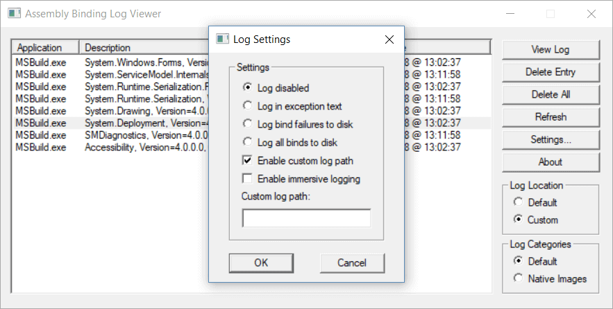

Just trying to get rid of this complicated thing ...

Or did you know what **"Enable immersive logging"** means? Or why you should separate log categories from **"Default" and "Native Images"**?
Did you ever **forget to disable the log again** and wondered why every .NET application is that slow and your disk runs out of space?

### Introducing Fusion++

#### Forget all the setup upfront - just hit "Capture" to capture your assembly logs. If you are done, click "Stop" again. That's it.

Fusion++ then parses all the log files for you. There's no need to go hunting for the "custom log path" at all. Fusion++ logs it's sessions to the Windows TEMP folders so that it can be cleaned up with the default Windows tools.

In addition, Fusion++ will try to find warnings and errors and highlight the parsed records accordingly so that you don't have to search anymore. 
Similar assembly bindings which happened at the same time (within 3 seconds tolerance) are automatically aggregated to keep the assembly list short.

If you need old logs, you can browse and even ex- and import them.

#### Maybe most important:

Fusion++ uses the same settings as the "Assembly Binding Log Viewer", so it uses the built-in .NET log functionality. It will back up your "Assembly Binding Log Viewer" settings as long as it is executed. As soon as you close it, it will re-apply them to make the application as transparent as possible. 
But as long you are executing Fusion++, it automatically takes care of all the stuff for you. No radio buttons, no custom log paths, no files you have to go through.

Everyone needs a hobby.
